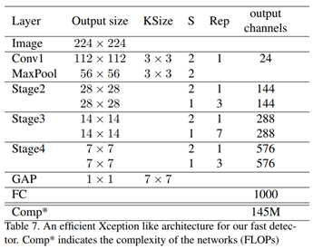

# Light_head_R_CNN_xception

The source code in this repository contain [*Light-Head R-CNN: In Defense of Two-Stage Object Detector*](https://arxiv.org/pdf/1711.07264.pdf) that use xception* backbone network. It is based on the code from [zengarden](https://github.com/zengarden/light_head_rcnn). I tried it with Pascal VOC and COCO dataset. The test mAP and FPS of the original paper has not yet been achieved. It would be great if someone would give me a advice. The network architecture is below from [original paper](https://arxiv.org/pdf/1711.07264.pdf).



## Requirement:
same as in [here](https://github.com/zengarden/light_head_rcnn).

## Installation:
1. Clone the Light_head_R_CNN_xception repository.
```
git clone https://github.com/geonseoks/Light_head_R_CNN_xception
```
2. Move the resnet_v1.py and resnet_utils.py into ~your_light_head_rcnn_original_directory/lib/utils/tf_utils/basemodel.

3. Move the network_desp.py into ~your_light_head_rcnn_original_directory/experiments/user/network_desp.py.

File structure as follows:
```
~Your_light_head_rcnn_original_directory/
    |->experiments
    |    |->user
    |    |    |->network_desp.py
    |->lib
    |    |->utils
    |    |    |->tf_utils
    |    |    |    |->basemodel
    |    |    |    |    |->resnet_v1.py
    |    |    |    |    |->resnet_utils.py    
```

## Train:
same as in [here](https://github.com/zengarden/light_head_rcnn).

## Evalution:
same as in [here](https://github.com/zengarden/light_head_rcnn).

## Result:
|                             Train data                          |                             Test data                           | ImageNet backbone accuracy at 224*224 (%) |   Base model   | Input resolution |     GPU    |   FPS  | Epochs | mAP (%) |
|:---------------------------------------------------------------:|:---------------------------------------------------------------:|:-----------------------------------------:|:---------------|:----------------:|:----------:|:------:|:------:|:-------:|
|            [MSCOCO](http://cocodataset.org/#download)           |            [MSCOCO](http://cocodataset.org/#download)           |    65.0                                  |    xception*   |     700x1100     | GTX 1080Ti |  51.89 |   30   |   26.1  |
|            [MSCOCO](http://cocodataset.org/#download)           |            [MSCOCO](http://cocodataset.org/#download)           |    65.0                                  |    xception*   |     700x1100     | TITAN X PASCAL |  31.0 |   30   |   26.1  |
|            [VOC07](http://http://host.robots.ox.ac.uk/pascal/VOC/voc2007/)           |            [VOC07](http://http://host.robots.ox.ac.uk/pascal/VOC/voc2007/)           |    65.0                                  |    xception*   |     700x1100     | GTX 1080Ti |  54.07 |   -   |   62.0  |
|            [VOC07](http://http://host.robots.ox.ac.uk/pascal/VOC/voc2007/)           |            [VOC07](http://http://host.robots.ox.ac.uk/pascal/VOC/voc2007/)           |    65.0                                  |    xception*   |     700x1100     | TITAN X PASCAL |  33.4 |   -   |   62.0  |
|            [VOC07](http://http://host.robots.ox.ac.uk/pascal/VOC/voc2007/)           |            [VOC07](http://http://host.robots.ox.ac.uk/pascal/VOC/voc2007/)           |    65.0                                  |    xception*   |     144x144     | TITAN X PASCAL |  164.0 |   -   |   56.9  |
|            [VOC07](http://http://host.robots.ox.ac.uk/pascal/VOC/voc2007/)+[VOC12](http://http://host.robots.ox.ac.uk/pascal/VOC/voc2012/)           |            [VOC07](http://http://host.robots.ox.ac.uk/pascal/VOC/voc2007/)           |    65.0                                  |    xception*   |     144x144     | TITAN X PASCAL |  174.0 |   -   |   61.0  |
|            [VOC07](http://http://host.robots.ox.ac.uk/pascal/VOC/voc2007/)           |            [VOC07](http://http://host.robots.ox.ac.uk/pascal/VOC/voc2007/)           |    65.0                                  |    xception*   |     128x128     | TITAN X PASCAL |  180.4 |   -   |   55.0  |
|            [VOC07](http://http://host.robots.ox.ac.uk/pascal/VOC/voc2007/)+[VOC12](http://http://host.robots.ox.ac.uk/pascal/VOC/voc2012/)           |            [VOC07](http://http://host.robots.ox.ac.uk/pascal/VOC/voc2007/)           |    65.0                                  |    xception*   |     128x128     | TITAN X PASCAL |  - |   -   |   59.9  |

